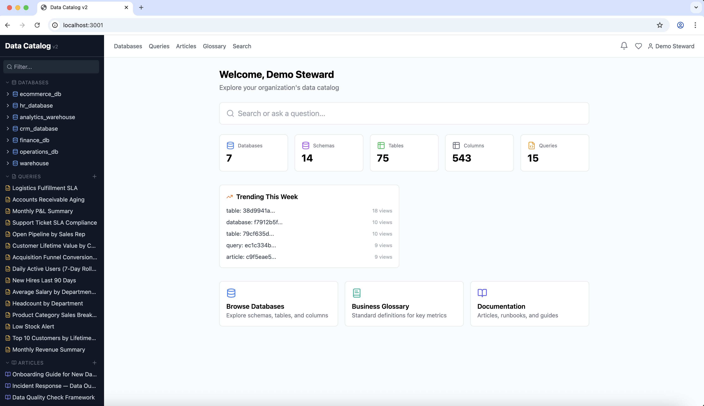
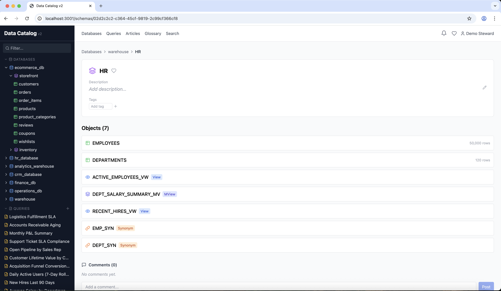
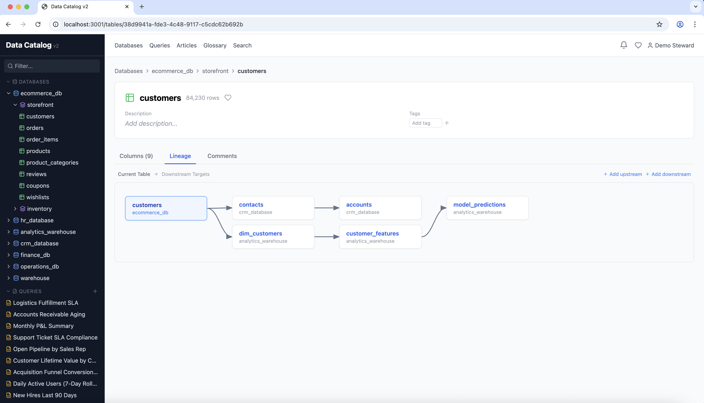
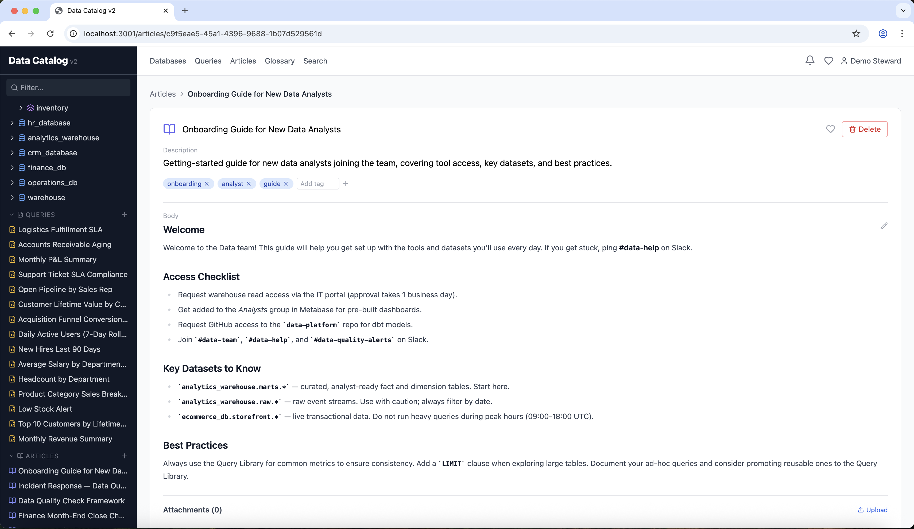
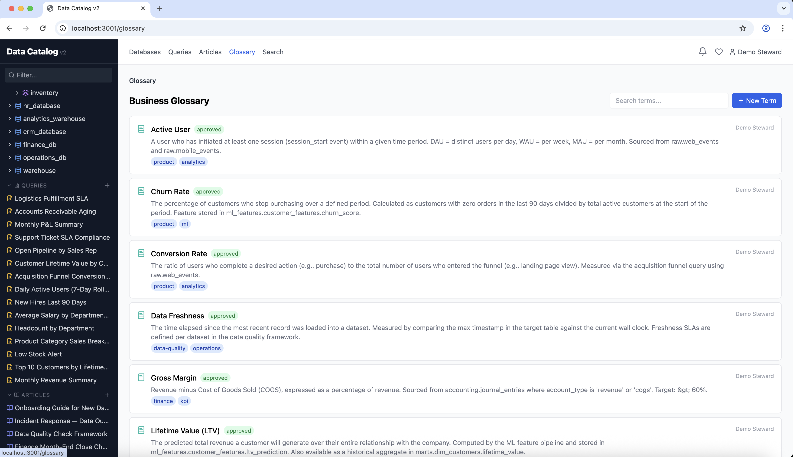
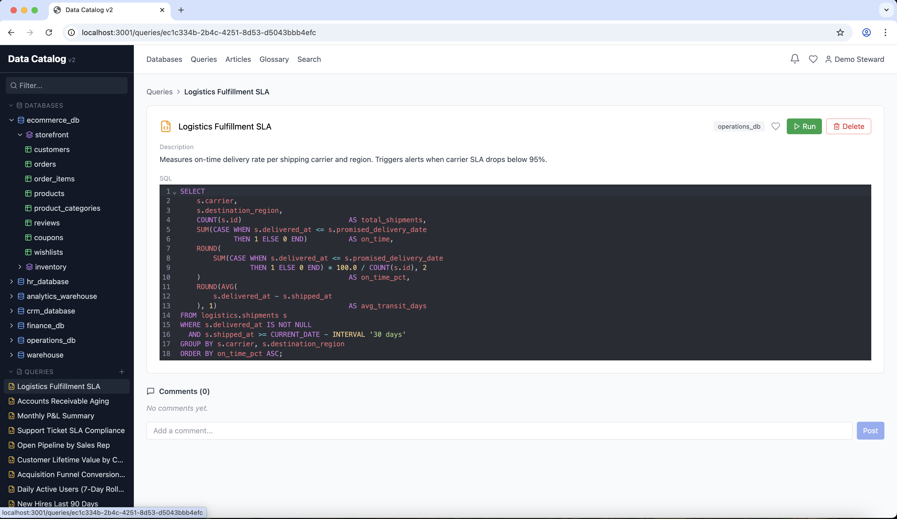

# Data Catalog

An enterprise-grade metadata management and data governance platform. It provides a centralized hub for discovering, understanding, and governing data assets across multiple databases and data systems. Teams use it to browse database hierarchies, search for tables and columns, trace data lineage, enforce governance policies, collaborate through comments and documentation, and run ad-hoc queries — all from a single web interface.

## Core Capabilities

### 1. Metadata Management

**Hierarchical Data Browsing**

The catalog organizes metadata in a four-level hierarchy: Database > Schema > Table/View > Column. Users can navigate this hierarchy through:

- A collapsible sidebar tree showing all databases, schemas, and tables
- Dedicated detail pages for each level with editable descriptions, tags, and SME contacts
- Breadcrumb navigation for quick traversal between levels

**Object Type Awareness**

Tables are not the only database objects. The catalog distinguishes between:

- **Tables** — standard relational tables (green icon)
- **Views** — virtual tables backed by SQL queries (blue icon)
- **Materialized Views** — pre-computed query results stored on disk (indigo icon)
- **Synonyms** — aliases pointing to other database objects (orange icon)

Views and materialized views include a "Definition" tab displaying the underlying SQL.

**Column-Level Detail**

Each table exposes its columns with:

- Data type, nullability, and primary key indicators
- Editable title (friendly name) and description fields
- Tags for categorization
- Column profiling statistics (null percentage, distinct count, min/max values, sample values)
- Searchable and paginated column listings

**Bulk Metadata Ingestion**

External tools and scripts can push metadata into the catalog via a REST API (`POST /api/v1/ingest/batch`). The ingestion endpoint:

- Accepts database, schema, table, and column metadata in a single payload
- Supports upsert semantics — creates new records or updates existing ones
- Handles soft-deleted entities by restoring them on re-ingest
- Is protected by an API key for machine-to-machine authentication
- Defaults `object_type` to `"table"` for backward compatibility

### 2. Full-Text Search

Powered by **Meilisearch**, the search system indexes seven entity types: databases, schemas, tables, columns, queries, articles, and glossary terms.

- **Global search bar** with autocomplete in the sidebar and header
- **Multi-index search** returns results across all entity types in a single query
- **Typo tolerance** handles misspellings automatically
- **Filterable attributes** allow narrowing results by entity type, database, schema, or object type
- **Breadcrumb context** in search results shows where each entity lives in the hierarchy

### 3. Data Lineage

The lineage system tracks upstream and downstream data flows between tables across databases.

- **Visual lineage graph** using BFS traversal with expandable nodes
- **Multi-hop traversal** — configure the number of levels to explore upstream or downstream
- **Cross-database lineage** — trace data flows across different source systems
- **Manual edge creation** — stewards can create lineage edges by searching for source and target tables
- **Edge deletion** — remove incorrect or outdated lineage relationships
- **Batch ingestion** — bulk-load lineage edges via the ingest API

### 4. Data Governance

**Data Classification**

Apply sensitivity labels to any entity (table, column, etc.) at four levels:

| Level | Description |
|-------|-------------|
| Public | Open data, no restrictions |
| Internal | Internal use only |
| Confidential | Sensitive business data |
| Restricted | Highly sensitive (PII, financial) |

Each classification includes a reason and tracks who applied it.

**Approval Workflows**

Stewards can gate metadata changes behind an approval process:

1. A user submits a change request with proposed modifications (stored as JSON)
2. A steward reviews the request and approves or rejects it with a comment
3. The full workflow is captured in the audit log

**Resource-Level Permissions**

Fine-grained access control at the individual entity level:

- Grant users `steward`, `editor`, or `viewer` roles on specific resources
- Track who granted each permission
- Revoke permissions when no longer needed

**Audit Logging**

Every create, update, and delete action is recorded with:

- The entity affected (type and ID)
- The actor who performed the action
- Old and new data snapshots (as JSON)
- A request ID for correlation across operations
- A timestamp for chronological tracking

### 5. Collaboration

**Comments**

Users can leave comments on any entity — tables, columns, schemas, glossary terms, articles, and more. Comments support HTML content (sanitized for safety) and can be deleted by the author or a steward.

**Favorites**

Bookmark frequently accessed entities for quick retrieval. The favorites page provides a personalized shortcut to important resources.

**Notifications**

An in-app notification system alerts users to:

- New comments on entities they follow
- Approval request status changes
- Data quality alerts
- System-level announcements

Notifications include an unread count badge in the header and support mark-as-read (individually or in bulk).

### 6. Documentation

**Articles**

A built-in knowledge base for data documentation:

- Rich-text editing with a WYSIWYG editor (TipTap)
- File attachments stored in MinIO (S3-compatible object storage)
- Tagging for categorization and discovery
- SME (Subject Matter Expert) contact information
- Full-text searchable through Meilisearch

**Business Glossary**

Define and standardize business terminology:

- Create glossary terms with definitions, owners, and tags
- Link terms to specific database entities (tables, columns) for context
- Workflow support with draft and approved statuses
- Searchable and browsable through a dedicated tree sidebar

### 7. Query Library

Save, organize, and share SQL queries:

- Store queries with name, description, and associated database connection
- Edit SQL in a syntax-highlighted editor (CodeMirror)
- Associate queries with SME contacts
- Browse queries in a sidebar tree organized by database

### 8. Query Runner

Execute read-only SQL queries directly from the browser:

- SQL editor with syntax highlighting
- Safety guardrails: only `SELECT`, `WITH`, and `EXPLAIN` statements allowed
- Statement timeout of 10 seconds to prevent runaway queries
- Results limited to 1,000 rows with truncation indicator
- Read-only transaction mode enforced at the database level

### 9. AI-Powered Discovery

A context-aware AI assistant helps users find relevant data:

- Natural language questions about data assets (e.g., "What tables have order data?")
- Contextual answers referencing specific tables and schemas
- Confidence scoring (high/medium/low) on responses
- Suggested related search queries for further exploration
- Integrated into the dashboard search bar

### 10. Usage Analytics

Track how the catalog is being used:

- **View tracking** — every entity page visit is recorded
- **Popular entities** — all-time most viewed resources
- **Trending entities** — resources gaining traction in the past 7 days
- Dashboard widgets showing key statistics (database count, table count, etc.)

### 11. Webhooks

Subscribe to catalog events for external integrations:

- Configure webhook endpoints with custom URLs
- Select which event types to subscribe to
- HMAC-signed payloads for security
- Delivery history with response codes and bodies
- Enable/disable webhooks without deleting them

### 12. Administration

**User Management**

- View all registered users
- Assign roles: viewer, steward, or admin
- Track last login timestamps

**System Operations**

- Trigger full Meilisearch reindex from the admin panel
- View the complete audit log with filtering by entity type
- Monitor system health via the `/health` endpoint

## User Roles

| Role | Capabilities |
|------|-------------|
| **Viewer** | Browse metadata, search, view lineage, leave comments, manage favorites |
| **Steward** | Everything a viewer can do, plus: edit descriptions/tags, manage classifications, review approvals, create lineage edges, manage glossary terms, access audit logs |
| **Admin** | Everything a steward can do, plus: manage users and roles, system administration |

## Authentication

The platform supports multiple authentication methods:

- **Google OAuth 2.0** — sign in with Google accounts
- **Azure Active Directory** — enterprise SSO via Azure AD
- **Generic OIDC** — any OpenID Connect provider with automatic group-to-role mapping
- **Local email/password** — built-in authentication with bcrypt password hashing

All sessions are managed via JWT tokens with configurable expiration (default: 8 hours). Logout invalidates tokens via a Redis-backed blacklist.

## Documentation

- [Architecture](docs/ARCHITECTURE.md) — system design, tech stack, data models, and deployment
- [Setup Instructions](docs/SETUP.md) — step-by-step guide to run the application
